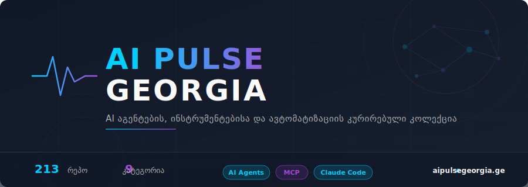

  

<h1 align="center">Awesome AI Pulse Georgia</h1>

  <b>AI აგენტების, დეველოპერ ინსტრუმენტებისა და ავტომატიზაციის კურირებული კოლექცია</b> 
  შერჩეული <a href="https://aipulsegeorgia.ge">AI Pulse Georgia</a>-ს მიერ

  
  
  
  
  

<i>A curated collection of AI agent frameworks, developer tools, and automation resources — by AI Pulse Georgia</i>

---

## 🚀 დაიწყე აქედან

**ახალი ხარ AI ხელსაწყოებში?** აირჩიე შენი როლი — გაჩვენებთ საიდან დაიწყო:

| ვინ ხარ? | რას გირჩევთ | სად ნახო |
|---|---|---|
| 💻 **დეველოპერი ვარ** | Claw Code, Claude Code + Superpowers, Context7 | [კოდინგ აგენტები](#-კოდინგ-აგენტები) + [Claude Code პლაგინები](#-claude-code-პლაგინები-და-უნარები) |
| 💼 **ბიზნესს ვაავტომატებ** | OpenClaw, Paperclip, n8n-MCP, Make | [მზა AI აგენტები](#-მზა-ai-აგენტები-ბიზნესისთვის) + [MCP ინტეგრაციები](#-mcp-ინტეგრაციები) |
| 📊 **მონაცემებს ვაგროვებ** | Browser Use, Firecrawl MCP, Apify MCP | [ვებ სკრეიპინგი და ბრაუზერი](#-ვებ-სკრეიპინგი-და-ბრაუზერი) |
| 🔍 **AI-ს ვცდი/ვსწავლობ** | Awesome Claude Code, Free LLM APIs, Claude How-To | [სასწავლო რესურსები](#-რესურსები-და-სასწავლო-მასალები) |
| 🧠 **AI მკვლევარი ვარ** | mem0, MemPalace, LightRAG, RAG-Anything, AutoResearch | [მეხსიერება და RAG](#-მეხსიერება-და-rag) + [აგენტების ფრეიმვორკები](#-ai-აგენტების-ფრეიმვორკები) |

---

## 🇬🇪 Made in Georgia

ეს პროექტები საქართველოში შეიქმნა — დააჭირე ვარსკვლავი ლოკალური AI კომუნიტის გასაძლიერებლად:

- **[Claude Code Setup](https://github.com/tornikebolokadze1-cyber/claude-code-setup)** — Claude Code-ის პროდაქშენ-დონის კონფიგურაცია
- **[Georgian Payments Skills](https://github.com/erekle1/georgian-payments-skills)** — TBC და BOG ბანკების API უნარები AI-სთვის

---

## სარჩევი

- [🤖 კოდინგ აგენტები](#-კოდინგ-აგენტები)
- [⚡ Claude Code პლაგინები და უნარები](#-claude-code-პლაგინები-და-უნარები)
- [🔌 MCP ინტეგრაციები](#-mcp-ინტეგრაციები)
- [🕷️ ვებ სკრეიპინგი და ბრაუზერი](#-ვებ-სკრეიპინგი-და-ბრაუზერი)
- [🧬 AI აგენტების ფრეიმვორკები](#-ai-აგენტების-ფრეიმვორკები)
- [💼 მზა AI აგენტები ბიზნესისთვის](#-მზა-ai-აგენტები-ბიზნესისთვის)
- [🧠 მეხსიერება და RAG](#-მეხსიერება-და-rag)
- [⚙️ AI ინფრასტრუქტურა და ხელსაწყოები](#-ai-ინფრასტრუქტურა-და-ხელსაწყოები)
- [📚 რესურსები და სასწავლო მასალები](#-რესურსები-და-სასწავლო-მასალები)

---

## 🤖 კოდინგ აგენტები

> **Coding Agents & CLI IDEs** — სტენდ-ალონ AI კოდის წერის ხელსაწყოები. Claude Code-ის და Cursor-ის ალტერნატივები.

| რეპოზიტორია | ⭐ | აღწერა |
|---|---|---|
| [Claw Code](https://github.com/ultraworkers/claw-code) | 175K | 🔥 ღია კოდის Claude Code clone Rust-ში — GitHub-ის ისტორიაში ყველაზე სწრაფად 100K ვარსკვლავის მიმღწევი რეპო. 2026-ის უმთავრესი ვირუსული მომენტი AI კოდინგ ხელსაწყოებში. |
| [opencode](https://github.com/anomalyco/opencode) | 138K | ღია კოდის coding agent — Claude Code-ის და Cursor-ის ალტერნატივა CLI ფორმატში. ერთ-ერთი ყველაზე პოპულარული ღია AI კოდინგ ხელსაწყო GitHub-ზე. |
| [Gemini CLI](https://github.com/google-gemini/gemini-cli) | 89.8K | Google-ს ღია კოდის ტერმინალის AI აგენტი — Gemini მოდელი პირდაპირ CLI-ში. 1M ტოკენის კონტექსტი, MCP მხარდაჭერა, Apache 2.0 ლიცენზია. Claude Code-ს მთავარი კონკურენტი. |
| [Cline](https://github.com/cline/cline) | 58K | ავტონომიური კოდინგ აგენტი VS Code-ში — human-in-the-loop ყოველ ცვლილებაზე. 5M+ ინსტალაცია, მუშაობს Cursor-ში, JetBrains-ში, Zed-ში და Neovim-ში. |
| [oh-my-openagent](https://github.com/code-yeongyu/oh-my-openagent) | 49K | „omo" — უნივერსალური agent harness სხვადასხვა AI კოდინგ აგენტებისთვის. ადრე ცნობილი იყო „oh-my-opencode"-ის სახელით (არ აერიოს Oh My ClaudeCode-ში — სრულიად განსხვავებული პროექტია). |
| [Aider](https://github.com/Aider-AI/aider) | 42K | ტერმინალის AI pair programming — 4.1M ინსტალაცია, ღია კოდი. ტერმინალში AI-თან ერთად კოდის წერის პიონერი. |
| [Goose](https://github.com/block/goose) | 38K | Block-ის (Square და Cash App-ის შემქმნელი) extensible AI კოდის აგენტი. სცდება შემოთავაზებებს — ინსტალირებს, ასრულებს, არედაქტირებს და ტესტავს. მუშაობს ნებისმიერ LLM-თან. |
| [Tabby](https://github.com/TabbyML/tabby) | 32K | Self-hosted AI კოდის ასისტენტი — on-premises კოდის დასრულება და ჩატი. Enterprise SSO, GPU/CPU inference, მრავალ IDE-ს მხარდაჭერა. |
| [Continue.dev](https://github.com/continuedev/continue) | 30K | სრულად ღია კოდის IDE extension — VS Code, JetBrains. ნებისმიერ მოდელთან მუშაობს, კორპორატიული გამოწერები არ სჭირდება. |
| [Taskmaster](https://github.com/eyaltoledano/claude-task-master) | 26K | AI-ზე დაფუძნებული ამოცანების მართვის სისტემა — პროექტის დაგეგმვა, ამოცანების ავტომატური დაშლა ქვე-ამოცანებად, პრიორიტეტების მართვა და დამოკიდებულებების თვალყურის დევნება. მუშაობს Cursor-ში, Windsurf-ში, Claude Code-ში და სხვა AI ჩატებში. MCP სერვერითაც და CLI-ითაც ხელმისაწვდომია. |
| [OpenClaude](https://github.com/Gitlawb/openclaude) | 18K | ღია კოდის coding-agent CLI — OpenAI, Gemini, DeepSeek, Ollama, Codex, GitHub Models და 200+ მოდელი ერთ ტერმინალში. OpenAI-თავსებადი API-ებით მუშაობს, აქვს slash ბრძანებები, MCP მხარდაჭერა, streaming output და VS Code გაფართოება. (არ აერიოს OpenClaw-ში — სრულიად სხვა პროექტია). |
| [Kilocode](https://github.com/kilo-org/kilocode) | 18K | All-in-one agentic engineering პლატფორმა და VS Code extension. #1 coding agent OpenRouter-ზე, 1.5M+ მომხმარებელი, 25T+ tokens დამუშავებული. ბუნებრივი ენით კოდი, თვით-ვერიფიკაცია, ტერმინალის ბრძანებები, ბრაუზერის ავტომატიზაცია, inline autocomplete და 500+ მოდელის მხარდაჭერა (Gemini, Claude, GPT). |
| [cmux](https://github.com/manaflow-ai/cmux) | 13K | Ghostty-ზე დაფუძნებული macOS ტერმინალი ვერტიკალური ტაბებითა და ნოტიფიკაციებით — სპეციალურად AI კოდინგ აგენტებისთვის შექმნილი. პარალელური სესიების მართვა გამარტივებულია. |
| [Codex Plugin](https://github.com/openai/codex-plugin-cc) | 11K | OpenAI-ს ოფიციალური პლაგინი Claude Code-ისთვის — Codex აგენტს კოდის მიმოხილვისა და დავალებების დელეგირების საშუალებას აძლევს. /codex:review, /codex:rescue ბრძანებები. |

---

## ⚡ Claude Code პლაგინები და უნარები

> **Claude Code Plugins & Skills** — Claude Code-ში ჩასართავი გაფართოებები: skills, plugins, hooks, configs.

| რეპოზიტორია | ⭐ | აღწერა |
|---|---|---|
| [Everything Claude Code](https://github.com/affaan-m/everything-claude-code) | 144K | Claude Code-ის ყოვლისმომცველი რესურსებისა და ოპტიმიზაციის სისტემა — უნარები, ინსტინქტები, მეხსიერების ოპტიმიზაცია, უსაფრთხოების სკანირება. npm პაკეტები და GitHub აპლიკაცია. |
| [Superpowers](https://github.com/obra/superpowers) | 134K | კომპოზირებადი workflow ფრეიმვორკი AI კოდის აგენტებისთვის. სპეციფიკაციაზე დაფუძნებული დეველოპმენტი, TDD, debugging, brainstorming და პარალელური ქვე-აგენტების დისპეტჩერიზაცია. |
| [UI UX Pro Max](https://github.com/nextlevelbuilder/ui-ux-pro-max-skill) | 60K | UI/UX დიზაინის ინტელექტი AI კოდის აგენტებისთვის — 50 დიზაინის სტილი, 21 ფერთა პალიტრა და მრავალი ფრეიმვორკის მხარდაჭერა. |
| [GSD (Get Shit Done)](https://github.com/gsd-build/get-shit-done) | 47K | მეტა-პრომპტინგის და კონტექსტის ინჟინერიის სისტემა. აგვარებს „context rot"-ს — ხარისხის გაუარესებას კონტექსტის ფანჯრის შევსებისას. მუშაობს Claude Code, Codex, Cursor, Gemini CLI-სთან. |
| [Claude Mem](https://github.com/thedotmack/claude-mem) | 45K | Claude Code-ის მეხსიერების პლაგინი — ავტომატურად იჭერს სესიის კონტექსტს, AI-ით ახდენს კომპრესიას და მომავალ სესიებში რელევანტურ კონტექსტს აბრუნებს. |
| [Oh My ClaudeCode](https://github.com/yeachan-heo/oh-my-claudecode) | 23K | მრავალაგენტური ორკესტრაციის პლაგინი — autopilot (5-ფაზიანი pipeline), team (პარალელური აგენტები), ralph (ვერიფიკაციამდე მუშაობს) და ultrawork (მაქსიმალური პარალელიზმი) რეჟიმები. |
| [Obsidian Skills](https://github.com/kepano/obsidian-skills) | 19K | Obsidian vault-ებთან მუშაობის უნარები — Markdown, Bases და JSON Canvas ფაილების წაკითხვა, ჩაწერა და ძიება. Claude Code-თან და Codex CLI-თან თავსებადი. |
| [Claude Plugins Official](https://github.com/anthropics/claude-plugins-official) | 16K | Anthropic-ის ოფიციალური Claude Code პლაგინების დირექტორია. ხარისხიანი, ვერიფიცირებული პლაგინების კატალოგი პირდაპირ Claude-ის შემქმნელებისგან. |
| [Career-Ops](https://github.com/santifer/career-ops) | 13K | Claude Code-ზე დაფუძნებული AI სამუშაოს ძიების pipeline. შეფასებს ვაკანსიებს A-F სკალით (10 კრიტერიუმი), წერს ATS-ოპტიმიზებულ CV-ებს თითო პოზიციაზე მორგებულად, ავტომატურად სკანირებს Greenhouse, Ashby, Lever-ს და თვალს ადევნებს ყველაფერს. 14 skill mode + Go dashboard. |
| [n8n Skills](https://github.com/czlonkowski/n8n-skills) | 4K | 7 ურთიერთშემავსებელი უნარი n8n workflow-ების ასაწყობად. ასწავლის AI ასისტენტებს MCP ინსტრუმენტების სწორ გამოყენებას და workflow პატერნების შერჩევას. თანმხლები: [n8n-MCP](https://github.com/czlonkowski/n8n-mcp). |
| [Claude Peers MCP](https://github.com/louislva/claude-peers-mcp) | 1.7K | რამდენიმე Claude Code ინსტანცია ერთმანეთს აღმოაჩენს და რეალურ დროში კომუნიკაციას ამყარებს. სხვადასხვა პროექტზე პარალელური მუშაობისთვის. |
| [Claude Code Setup](https://github.com/tornikebolokadze1-cyber/claude-code-setup) | 9 | Claude Code-ის პროდაქშენ-დონის კონფიგურაციის სისტემა — უსაფრთხოების წესები, ავტომატური hooks და /setup ბრძანება ახალი პროექტებისთვის. Made in Georgia 🇬🇪. |
| [Graphify](https://github.com/safishamsi/graphify) | 1.9K | კოდბეისს queryable knowledge graph-ად აქცევს — 71.5x ნაკლები ტოკენი ვიდრე raw ფაილების კითხვა. მხარს უჭერს კოდს, PDF-ებს, Markdown-ს, სქრინშოტებს და დიაგრამებს. მუშაობს Claude Code-თან, Cursor-თან, Gemini CLI-თან და Codex-თან. |
| [Georgian Payments Skills](https://github.com/erekle1/georgian-payments-skills) | 2 | ქართული ბანკების API უნარები — TBC Bank (Checkout, TPay, XML Billing) და Bank of Georgia (iPay, Installments, Open Banking PSD2). AI კოდის ასისტენტებისთვის ექსპერტ-დონის ცოდნა. Made in Georgia 🇬🇪. |

---

## 🔌 MCP ინტეგრაციები

> **MCP Servers** — Model Context Protocol სერვერები, რომლებიც AI ასისტენტებს რეალური სამყაროს ხელსაწყოებთან აკავშირებენ.

### 🏛️ მთავარი ინფრასტრუქტურა

| რეპოზიტორია | ⭐ | აღწერა |
|---|---|---|
| [MCP Servers](https://github.com/modelcontextprotocol/servers) | 83K | MCP-ის ოფიციალური საცნობარო სერვერების კოლექცია — Filesystem, Git, Memory, Fetch, Sequential Thinking. 10 ენის SDK (TypeScript, Python, Go, Rust, Java, Kotlin, C#, Ruby, Swift, PHP). MCP ეკოსისტემის ფუნდამენტი. |
| [Context7](https://github.com/upstash/context7) | 52K | განახლებული, ვერსია-სპეციფიკური დოკუმენტაცია LLM-ებისთვის. აღმოფხვრის ჰალუცინირებულ API-ებსა და მოძველებულ კოდის მაგალითებს AI კოდინგ ასისტენტებში (Cursor, Claude Code). |

### 🛠️ დეველოპერი ხელსაწყოები

| რეპოზიტორია | ⭐ | აღწერა |
|---|---|---|
| [GitHub MCP](https://github.com/github/github-mcp-server) | 29K | GitHub-ის ოფიციალური MCP სერვერი — რეპოზიტორიების მართვა, Issue/PR ავტომატიზაცია, CI/CD მონიტორინგი და კოდის ანალიზი ბუნებრივი ენით. |
| [Figma Context MCP](https://github.com/GLips/Figma-Context-MCP) | 14K | Figma-ს დიზაინის მონაცემებს AI კოდინგ ასისტენტებს აწვდის. სკრინშოტებთან შედარებით გაცილებით ზუსტი — დიზაინიდან კოდში ერთი მცდელობით. |
| [Notion MCP](https://github.com/makenotion/notion-mcp-server) | 4.2K | Notion-ის ოფიციალური MCP სერვერი — გვერდებთან, მონაცემთა ბაზებთან და კონტენტთან მუშაობა. OAuth ავტორიზაცია და Markdown რედაქტირება. |
| [Supabase MCP](https://github.com/supabase-community/supabase-mcp) | 2.6K | Supabase პროექტებთან პირდაპირი კავშირი — ცხრილების მართვა, კონფიგურაცია და მონაცემთა შეკითხვები. OAuth ავტორიზაცია, Cursor, Claude და Windsurf მხარდაჭერა. |
| [Draw.io MCP](https://github.com/jgraph/drawio-mcp) | 2.3K | draw.io-ს ოფიციალური სერვერი — დიაგრამების შექმნა და რედაქტორში გახსნა. 4 მეთოდი: App Server, Tool Server, Skill+CLI, Project Instructions. XML, CSV, Mermaid ფორმატები. |

### 🔍 ძიება და კვლევა

| რეპოზიტორია | ⭐ | აღწერა |
|---|---|---|
| [Exa MCP](https://github.com/exa-labs/exa-mcp-server) | 4.1K | Exa-ს ძიების სერვერი — ვებ ძიება, კოდის ძიება და კომპანიების კვლევა. ჰოსტირებული სერვისი ერთი დაწკაპუნებით Cursor-სა და VS Code-ში ინტეგრაციით. |
| [Perplexity MCP](https://github.com/perplexityai/modelcontextprotocol) | 2.1K | Perplexity-ის ოფიციალური სერვერი — რეალურ დროში ვებ ძიება (perplexity_search), საუბრისმაგვარი AI (sonar-pro), ღრმა კვლევა (sonar-deep-research) და მსჯელობა (sonar-reasoning-pro). |
| [Tavily MCP](https://github.com/tavily-ai/tavily-mcp) | 1.6K | რეალურ დროში ვებ ძიება, კონტენტის ამოღება (extract), საიტის რუკის შედგენა (map) და crawling — ოთხივე ინსტრუმენტი ერთ MCP სერვერში. ჰოსტირებული ვერსია (mcp.tavily.com) ლოკალური ინსტალაციის გარეშე მუშაობს. |

### 📊 პროდუქტიულობა და კონტენტი

| რეპოზიტორია | ⭐ | აღწერა |
|---|---|---|
| [n8n-MCP](https://github.com/czlonkowski/n8n-mcp) | 17K | AI ასისტენტებს n8n workflow-ების ასაწყობად ღრმა ცოდნას აძლევს — 1,396 node-ის დოკუმენტაცია, 2,646 კონფიგურაცია და 2,709 workflow template. თანმხლები: [n8n-skills](https://github.com/czlonkowski/n8n-skills). |
| [Markdownify MCP](https://github.com/zcaceres/markdownify-mcp) | 2.5K | ნებისმიერი ფაილის Markdown-ად გარდაქმნა — PDF, სურათები, აუდიო (ტრანსკრიფციით), DOCX, XLSX, PPTX, YouTube ვიდეოს სუბტიტრები და ვებ გვერდები. AI ასისტენტებისთვის კონტენტის უნივერსალური კონვერტორი. |
| [LinkedIn MCP](https://github.com/stickerdaniel/linkedin-mcp-server) | 1.3K | LinkedIn პროფილების, კომპანიების, ვაკანსიების სკრეიპინგი და inbox-ის მართვა AI ასისტენტებიდან. |
| [Apify MCP](https://github.com/apify/apify-mcp-server) | 1K | 1000+ მზა სკრეიპერი — Instagram, TikTok, Amazon, Google Maps და ნებისმიერი ვებსაიტი. Apify Store-ის სრული კატალოგი AI ასისტენტებისთვის. |
| [Metricool MCP](https://github.com/metricool/mcp-metricool) | 33 | Metricool-ის ოფიციალური სერვერი — სოციალური მედიის მეტრიკების ანალიზი და პოსტების დაგეგმვა AI ასისტენტებიდან. Instagram, Facebook, Twitter/X, TikTok, LinkedIn სტატისტიკა. |

---

## 🕷️ ვებ სკრეიპინგი და ბრაუზერი

> **Web Scraping & Browser Automation** — ვებსაიტებიდან მონაცემების ამოღება და ბრაუზერის ავტომატიზაცია AI აგენტებისთვის.

| რეპოზიტორია | ⭐ | აღწერა |
|---|---|---|
| [Browser Use](https://github.com/browser-use/browser-use) | 86K | Python ბიბლიოთეკა, რომელიც ვებსაიტებს AI აგენტებისთვის ხელმისაწვდომს ხდის — კლიკი, ტექსტის შეყვანა, ნავიგაცია და მონაცემთა ამოღება ავტომატურად. |
| [Playwright MCP](https://github.com/microsoft/playwright-mcp) | 30K | Microsoft-ის ოფიციალური MCP სერვერი ბრაუზერის ავტომატიზაციისთვის. Accessibility snapshot-ებით მუშაობს — სკრინშოტები არ არის საჭირო. LLM-ისთვის ოპტიმიზებული. |
| [Agent Browser](https://github.com/vercel-labs/agent-browser) | 28K | Vercel Labs-ის ბრაუზერის ავტომატიზაციის CLI, შექმნილი სპეციალურად AI აგენტებისთვის. ღრმა ინტეგრაცია Vercel ეკოსისტემასთან და ოპტიმიზებული agent workflow-ებისთვის. |
| [Lightpanda](https://github.com/lightpanda-io/browser) | 23K | Zig-ში ნულიდან აშენებული headless ბრაუზერი AI-სა და ავტომატიზაციისთვის — Chrome-ზე 11x სწრაფი, 9x ნაკლები მეხსიერება. Puppeteer/Playwright-თავსებადი. |
| [Agent-Reach](https://github.com/Panniantong/Agent-Reach) | 16K | AI აგენტს „თვალებს" აძლევს ინტერნეტში — Twitter, Reddit, YouTube, GitHub, Bilibili, XiaoHongShu და სხვა პლატფორმების წაკითხვა და ძიება ერთიანი ინტერფეისით. |
| [opencli](https://github.com/jackwener/opencli) | 14K | უნივერსალური CLI hub — ნებისმიერ ვებსაიტს, Electron აპლიკაციას ან ლოკალურ ხელსაწყოს CLI-ად აქცევს AI აგენტებისთვის. AI-native runtime გრაფიკული აპლიკაციების ავტომატიზაციისთვის. |
| [Playwright CLI](https://github.com/microsoft/playwright-cli) | 6.9K | Playwright-ის CLI ინტერფეისი — ბრაუზერის ჩაწერა, კოდის გენერაცია და სელექტორების ინსპექტირება. MCP-ს overhead-ის გარეშე მსუბუქი ბრაუზერის კონტროლი. |
| [Firecrawl MCP](https://github.com/firecrawl/firecrawl-mcp-server) | 5.9K | Firecrawl-ის ოფიციალური სერვერი — ვებ სკრეიპინგი, crawling, ძიება, ღრმა კვლევა და Cloud browser სესიები. ავტომატური retry და rate limiting. |
| [Cloudflare MCP](https://github.com/cloudflare/mcp-server-cloudflare) | 3.6K | Cloudflare-ის 13+ MCP სერვერი — Workers, KV, R2, D1, Browser Rendering, DNS ანალიტიკა და დოკუმენტაცია. სრული პლატფორმის მართვა AI-დან. |
| [Bright Data MCP](https://github.com/brightdata/brightdata-mcp) | 2.3K | ვებ სკრეიპინგი anti-bot bypass-ით და proxy ქსელით. სტრუქტურირებული მონაცემების ამოღება ნებისმიერი ვებსაიტიდან ბლოკირების გარეშე. |

---

## 🧬 AI აგენტების ფრეიმვორკები

> **Agent Frameworks & Infrastructure** — ბიბლიოთეკები, SDK-ები და ინფრასტრუქტურა საკუთარი AI აგენტების ასაშენებლად.

| რეპოზიტორია | ⭐ | აღწერა |
|---|---|---|
| [AutoGen](https://github.com/microsoft/autogen) | 54.7K | Microsoft Research-ის მულტი-აგენტ ფრეიმვორკი რთული workflow-ებისთვის. Semantic Kernel-თან ერთად Microsoft Agent Framework-ის საფუძველი. |
| [AutoResearch](https://github.com/karpathy/autoresearch) | 68K | Andrej Karpathy-ს ავტონომიური ML კვლევის სისტემა — ავტომატურად ატარებს ექსპერიმენტებს ერთ GPU-ზე, ცვლის ჰიპერპარამეტრებს და ინახავს მხოლოდ გაუმჯობესებებს. |
| [CrewAI](https://github.com/crewaiinc/crewai) | 45.9K | AI აგენტების გუნდური ორკესტრაცია როლებით — თითოეულ აგენტს საკუთარი პასუხისმგებლობა აქვს. MCP და A2A პროტოკოლის მხარდაჭერა, 12M დღიური აგენტის ექსეკუცია. |
| [MiroFish](https://github.com/666ghj/MiroFish) | 51K | Swarm Intelligence ძრავი — ათასობით AI აგენტის სიმულაცია რეალური მონაცემებით პროგნოზირებისთვის. აგენტებს აქვთ ინდივიდუალური პიროვნებები და გრძელვადიანი მეხსიერება. Docker-ით განლაგება. |
| [nanobot](https://github.com/HKUDS/nanobot) | 38K | HKUDS-ის ულტრა-მსუბუქი პერსონალური AI აგენტი — მინიმალური რესურსები, მაქსიმალური შესაძლებლობები. სწრაფად იზრდება 2026 წელს. |
| [LangGraph](https://github.com/langchain-ai/langgraph) | 28.8K | სტატუსიანი აგენტების ორკესტრაცია გრაფებით — checkpointing, branching, rollback. პროდაქშენ-დონის deploy Uber-ში, LinkedIn-ში, Klarna-ში. |
| [Semantic Kernel](https://github.com/microsoft/semantic-kernel) | 27.6K | Microsoft-ის AI ორკესტრაციის SDK — plugin არქიტექტურა, C# და Python მხარდაჭერა. Azure AI Services-თან ღრმა ინტეგრაცია. |
| [Hermes](https://github.com/nousresearch/hermes-agent) | 29K | Nous Research-ის თვითგანვითარებადი AI აგენტი ჩაშენებული სწავლის ციკლით. ქმნის უნარებს გამოცდილებიდან, ინახავს მეხსიერებას სესიებს შორის. მხარს უჭერს Telegram, Discord, Slack, WhatsApp და cron ავტომატიზაციას. |
| [toon](https://github.com/toon-format/toon) | 24K | Token-Oriented Object Notation — JSON-ის ალტერნატივა LLM prompt-ებისთვის. Schema-aware, კომპაქტური ფორმატი, რომელიც ტოკენების მოხმარებას მნიშვნელოვნად ამცირებს და LLM-ისთვის უფრო წასაკითხია. |
| [Vercel AI SDK](https://github.com/vercel/ai) | 23.3K | TypeScript AI toolkit Next.js-ის შემქმნელებისგან — streaming, tool calling, agent primitives. Full-stack AI აპლიკაციების აშენების სტანდარტი. |
| [Mastra](https://github.com/mastra-ai/mastra) | 23K | TypeScript ფრეიმვორკი AI აპლიკაციებისა და აგენტებისთვის (Gatsby-ის გუნდისგან). ჩაშენებული workflows, RAG, evals და agent primitives — სრული toolkit თანამედროვე TypeScript stack-ში. |
| [Pydantic AI](https://github.com/pydantic/pydantic-ai) | 16.2K | Type-safe აგენტის ფრეიმვორკი Pydantic-ის გუნდისგან — production-grade observability, აგენტის run sharing. OpenAI, Google, Anthropic SDK-ები Pydantic-ზეა აშენებული. |
| [OpenSandbox](https://github.com/alibaba/OpenSandbox) | 10K | Alibaba-ს უსაფრთხო, სწრაფი და გაფართოებადი sandbox runtime AI აგენტების კოდის ექსეკუციისთვის. იზოლირებული გარემო — აგენტი კოდს ასრულებს თქვენი სისტემის რისკის გარეშე. |
| [OpenSpace](https://github.com/HKUDS/OpenSpace) | 3.9K | აგენტების თვითგანვითარების ფრეიმვორკი — AUTO-FIX, AUTO-IMPROVE, AUTO-LEARN. აგენტები ერთმანეთს უზიარებენ ნასწავლ უნარებს. მუშაობს Claude Code-თან, Codex-თან, OpenClaw-თან. |

---

## 💼 მზა AI აგენტები ბიზნესისთვის

> **Ready-Made AI Agents** — გამზადებული AI აგენტები, რომლებსაც ნებისმიერი მომხმარებელი (არც-დეველოპერი) ადვილად დანერგავს.

| რეპოზიტორია | ⭐ | აღწერა |
|---|---|---|
| [Langflow](https://github.com/langflow-ai/langflow) | 146K | DataStax-ის ვიზუალური drag-drop პლატფორმა AI აგენტებისა და RAG-ის ასაშენებლად. 100+ ინტეგრაცია, MCP მხარდაჭერა — კოდის წერა არ სჭირდება. |
| [Dify](https://github.com/langgenius/dify) | 136K | Full-stack აგენტური workflow პლატფორმა — ვიზუალური RAG, მოდელების მართვა, observability. GitHub-ის ერთ-ერთი ყველაზე პოპულარული AI პროექტი. |
| [Open WebUI](https://github.com/open-webui/open-webui) | 128K | Self-hosted AI ინტერფეისი Ollama-სა და OpenAI API-სთვის — ჩაშენებული RAG, ხმოვანი/ვიდეო ზარები, აგენტების შემქმნელი. 355K+ კომუნიტი. |
| [ComfyUI](https://github.com/comfy-org/ComfyUI) | 106K | მოდულარული node-based სურათისა და ვიდეოს AI გენერაციის პლატფორმა — 1,000+ custom node, ყოველკვირეული განახლებები ახალი მოდელების ინტეგრაციით. |
| [OpenClaw](https://github.com/openclaw/openclaw) | 350K | პირადი AI ასისტენტი ნებისმიერ მოწყობილობაზე. 20+ არხზე პასუხობს (WhatsApp, Telegram, Slack, Discord, iMessage), აქვს ხმოვანი ინტერფეისი და ცოცხალი Canvas. Local-first დიზაინი და მულტი-აგენტ routing. |
| [Paperclip](https://github.com/paperclipai/paperclip) | 49K | AI აგენტების პლატფორმა ბიზნესის ავტონომიურად წარმართვისთვის. აგენტების გუნდს ორკესტრირებს — org chart, ბიუჯეტი, governance და audit log ერთიან დაფაზე. |
| [Perplexica](https://github.com/ItzCrazyKns/Perplexica) | 27K | ღია კოდის AI ძიების ძრავა — კონფიდენციალური, წყაროებით დასაბუთებული პასუხები. ლოკალური LLM-ებით (Ollama) და ღრუბლოვანი პროვაიდერებით მუშაობს. Perplexity AI-ს self-hosted ალტერნატივა. |

---

## 🧠 მეხსიერება და RAG

> **Memory & RAG** — AI აგენტის გრძელვადიანი მეხსიერების სისტემები და Retrieval-Augmented Generation ფრეიმვორკები.

| რეპოზიტორია | ⭐ | აღწერა |
|---|---|---|
| [RAGFlow](https://github.com/infiniflow/ragflow) | 70K | Enterprise-grade RAG ძრავა აგენტური შესაძლებლობებით — დოკუმენტების ჭრა, embedding tuning, ევალუაცია. წამყვანი ღია კოდის RAG პლატფორმა. |
| [mem0](https://github.com/mem0ai/mem0) | 52K | უნივერსალური მეხსიერების ფენა AI აგენტებისთვის — აერთიანებს ვექტორულ ძიებას, გრაფ-რელაციებს და key-value საცავს ერთ სისტემაში. ერთ-ერთი ყველაზე პოპულარული standalone agent memory framework. |
| [LlamaIndex](https://github.com/run-llama/llama_index) | 48.4K | დოკუმენტების LLM-თან დაკავშირების წამყვანი ფრეიმვორკი — ინდექსირება, ძიება, აგენტები. მრავალწყაროიანი RAG pipeline-ების სტანდარტი. |
| [LightRAG](https://github.com/hkuds/lightrag) | 32K | მარტივი და სწრაფი RAG სისტემა ცოდნის გრაფზე დაფუძნებული ინდექსაციით. EMNLP 2025 აკადემიური პუბლიკაცია. |
| [GitNexus](https://github.com/abhigyanpatwari/GitNexus) | 23K | კოდის ინტელექტის ძრავა ნულოვანი სერვერით — GitHub რეპო ან ZIP ფაილი ჩააგდე ბრაუზერში და მიიღე ინტერაქტიული ცოდნის გრაფი ყველა დამოკიდებულებით, გამოძახების ჯაჭვითა და ექსეკუციის ნაკადით. ჩაშენებული Graph RAG აგენტი AI ასისტენტებს კოდის სრულ კონტექსტს აწვდის. |
| [MemPalace](https://github.com/milla-jovovich/mempalace) | 23K | AI მეხსიერების სისტემა, რომელმაც LongMemEval benchmark-ზე უმაღლესი ქულა (96.6%) მიიღო. "მეხსიერების სასახლის" ძველბერძნული კონცეფციით ინახავს ყველაფერს verbatim, არა AI-ს არჩევით — საუბრები ორგანიზებულია wings → halls → rooms სტრუქტურაში. Raw verbatim storage ChromaDB-ში, სრულად ლოკალური, უფასო და ღია კოდი. |
| [RAG-Anything](https://github.com/HKUDS/RAG-Anything) | 15K | All-in-One მულტიმოდალური RAG ფრეიმვორკი — ტექსტი, სურათი, ცხრილი, დიაგრამა ერთიან pipeline-ში. LightRAG-ის გუნდისგან (HKUDS). აკადემიური ნაშრომით გამყარებული. |
| [Hindsight](https://github.com/vectorize-io/hindsight) | 7.1K | აგენტის მეხსიერების სისტემა, რომელიც recall-ს სცილდება — აგენტები დროთა განმავლობაში სწავლობენ და უმჯობესდებიან. აკადემიური ნაშრომით გამყარებული (arXiv). |
| [Crawl4AI RAG](https://github.com/coleam00/mcp-crawl4ai-rag) | 2.1K | ვებ crawling + RAG ერთიან pipeline-ში — სკრეიპი, ვექტორულ ბაზაში შენახვა და ცოდნაზე დაფუძნებული კითხვა-პასუხი. Supabase-ზე დაფუძნებული. |
| [Prism MCP](https://github.com/dcostenco/prism-mcp) | 108 | კოგნიტური არქიტექტურის MCP სერვერი — მდგრადი მეხსიერება, თვითორგანიზებადი ცოდნის გრაფი, მულტი-აგენტური სინქრონიზაცია და ვიზუალური dashboard. |

---

## ⚙️ AI ინფრასტრუქტურა და ხელსაწყოები

> **AI Infrastructure & Tools** — მოდელების გაშვება, სერვინგი, ტრენინგი, ხმოვანი AI, ვიდეო გენერაცია და პროდუქტიულობა.

| რეპოზიტორია | ⭐ | აღწერა |
|---|---|---|
| [Ollama](https://github.com/ollama/ollama) | 165K | ლოკალურად LLM-ების გაშვება ერთი ბრძანებით — Llama, Mistral, Gemma, DeepSeek. GPU არ არის სავალდებულო. ყველაზე მარტივი გზა ლოკალური AI-ს გასაშვებად. |
| [vLLM](https://github.com/vllm-project/vllm) | 75K | ყველაზე პოპულარული ღია LLM serving ძრავა — PagedAttention ტექნოლოგია სწრაფი inference-ისთვის. პროდაქშენ-დონის მოდელების სერვინგის სტანდარტი. |
| [llama.cpp](https://github.com/ggml-org/llama.cpp) | 73K | C/C++ LLM inference ძრავა — CPU-ზეც კი აშვებს დიდ მოდელებს. GGUF ფორმატის სტანდარტი, ლოკალური AI-ს ფუნდამენტი. |
| [Unsloth](https://github.com/unslothai/unsloth) | 58K | ღია მოდელების fine-tuning სტუდია — Qwen, Gemma, DeepSeek. სწრაფი ტრენინგი ვებ ინტერფეისით, ლოკალური მოდელების პერსონალიზაციისთვის. |
| [Coqui TTS](https://github.com/coqui-ai/TTS) | 45K | Deep learning text-to-speech — ხმის კლონირება 3-10 წამის სემპლით, XTTS-v2 17 ენის მხარდაჭერით. პროდაქშენ-დონის ხმოვანი AI. |
| [SGLang](https://github.com/sgl-project/sglang) | 25K | მაღალი წარმადობის LLM serving — vLLM-ზე 29% სწრაფი H100-ზე. UC Berkeley-ს ლაბორატორიიდან, $400M სტარტაპად გარდაიქმნა. |
| [Google Workspace CLI](https://github.com/googleworkspace/cli) | 24K | ერთი CLI მთელი Google Workspace-ისთვის — Drive, Gmail, Calendar, Sheets, Docs, Chat, Admin. Google Discovery Service-იდან დინამიურად აგებს ბრძანებებს. 40+ აგენტის უნარი. |
| [HunyuanVideo](https://github.com/Tencent-Hunyuan/HunyuanVideo) | 11.7K | Tencent-ის ვიდეო გენერაციის ფრეიმვორკი — image-to-video, აუდიოზე დაფუძნებული ანიმაცია. წამყვანი ღია კოდის ვიდეო AI მოდელი. |
| [NotebookLM Python](https://github.com/teng-lin/notebooklm-py) | 8.9K | Google NotebookLM-ის არაოფიციალური Python API და CLI. სრული პროგრამული წვდომა ფუნქციებზე, მათ შორის ვებ ინტერფეისში მიუწვდომელ ფუნქციებზე. |
| [RealtimeTTS](https://github.com/KoljaB/RealtimeTTS) | 3K | რეალურ დროში text-to-speech — ხმის კლონირება, დაბალი latency GPU სინთეზი. Coqui, ElevenLabs, Piper ძრავების მხარდაჭერა. სრული ხმოვანი AI pipeline. |

---

## 📚 რესურსები და სასწავლო მასალები

> **Learning Resources** — სასწავლო რესურსები, awesome ლისტები, უფასო API-ები და ცნობარები.

| რეპოზიტორია | ⭐ | აღწერა |
|---|---|---|
| [Public APIs](https://github.com/public-apis/public-apis) | 419K | საჯარო API-ების ყოვლისმომცველი კატალოგი კატეგორიების მიხედვით. GitHub-ის ერთ-ერთი ყველაზე პოპულარული რეპოზიტორია. |
| [Awesome Claude Code](https://github.com/hesreallyhim/awesome-claude-code) | 36K | Claude Code-ის საუკეთესო რესურსების კურირებული სია — უნარები, hooks, slash-ბრძანებები, აგენტების ორკესტრატორები და პლაგინები. |
| [Free LLM API Resources](https://github.com/cheahjs/free-llm-api-resources) | 18K | უფასო LLM API რესურსების სია — OpenRouter, Google AI Studio, NVIDIA NIM, Mistral, Groq, Cerebras, Cohere, GitHub Models და სხვა პროვაიდერები. |
| [Claude How-To](https://github.com/luongnv89/claude-howto) | 18K | ვიზუალური სახელმძღვანელო Claude Code-სთვის — საწყისი კონცეფციებიდან მოწინავე აგენტებამდე, copy-paste შაბლონებით. |
| [Awesome DESIGN.md](https://github.com/VoltAgent/awesome-design-md) | 17K | DESIGN.md ფაილების კოლექცია პოპულარული ვებსაიტების დიზაინ-სისტემებიდან. ჩააგდე პროექტში, უთხარი AI აგენტს „ააგე ასეთი UI" და მიიღე pixel-perfect კოდი. Google Stitch-ის კონცეფცია — Markdown ფორმატში დიზაინის სისტემა. 55+ მზა DESIGN.md. |
| [LLM-Maintained Wiki (Karpathy)](https://gist.github.com/karpathy/442a6bf555914893e9891c11519de94f) | Gist | Andrej Karpathy-ის ბრწყინვალე კონცეფცია პერსონალური ცოდნის ბაზის აშენებისთვის LLM-ით. ნაცვლად RAG-ით ყოველ ჯერზე ძიებისა, LLM ინკრემენტულად აშენებს და ანახლებს დაკავშირებულ Markdown wiki-ს — კითხულობს ახალ წყაროებს, ცვლის ძველ გვერდებს, ანახლებს cross-reference-ებს. „LLM არ იღლება" — Karpathy. ცოდნის მართვის ახალი პარადიგმა. |

---

## ჩვენს შესახებ

  

ეს სია იმართება **[AI Pulse Georgia](https://aipulsegeorgia.ge)**-ს მიერ — საზოგადოება, რომელიც ფოკუსირებულია AI აგენტებზე, ავტომატიზაციაზე და ავტონომიური სისტემების მომავალზე.

> *„Exploring Georgia's AI Future"*

თუ ეს სია გამოგადგებათ, მიეცით ვარსკვლავი და გაუზიარეთ სხვებს, ვინც AI აგენტებით აშენებს.

## წვლილის შეტანა

იპოვეთ შესანიშნავი რეპოზიტორია, რომელიც ამ სიაში ჯდება? გახსენით issue ან გამოაგზავნეთ pull request.

## ლიცენზია

